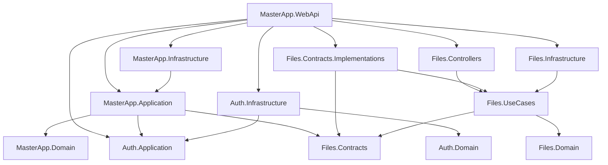

# Архитектура проекта

## Общая картина

Проект представляет собой модульный монолит на ASP.NET Core Web API. Один исполняемый сервис `MasterApp.WebApi` собирает несколько доменных модулей и публикует HTTP API для мобильного мастера и диспетчера.

Активная кодовая база находится в `src/`. Старый каталог `project/` и прежние memory-bank файлы в текущем рабочем дереве удалены, поэтому архитектурно значимым источником является именно `src/`.

Основные доменные области:

- `Auth` - пользователи, роли, устройства, JWT, refresh tokens, SSO для диспетчеров.
- `Master` - основной бизнес-домен: организации, мастера, услуги, заявки, статусы, уведомления.
- `Files` - загрузка, хранение, получение ссылок и удаление вложений через MinIO.

## Технологический стек

- Runtime: `.NET 9`, ASP.NET Core Controllers.
- API: MVC controllers, Swagger/Swashbuckle, JWT Bearer authentication.
- База данных: PostgreSQL через EF Core/Npgsql.
- Хранилище файлов: MinIO.
- Application patterns: service layer в `Master` и `Auth`, CQRS/MediatR в `Files`.
- Валидация: FluentValidation в модуле `Files`.
- Mapping: Riok.Mapperly в `Files.Contracts.Implementations`.
- Deploy: Docker, GitLab CI, Kubernetes manifests.

## Структура решения

Решение: `src/MasterApp.sln`.

Проекты:

- `MasterApp.WebApi` - HTTP host, composition root, controllers.
- `MasterApp.Migrator` - консольный мигратор EF Core.
- `Auth/MasterApp.Auth.Domain` - доменные сущности Auth.
- `Auth/MasterApp.Auth.Application` - интерфейсы и сервисы Auth.
- `Auth/MasterApp.Auth.Infrastructure` - `AuthDbContext`, JWT, SSO, persistence.
- `Master/MasterApp.Domain` - сущности основного бизнес-домена.
- `Master/MasterApp.Application` - use-case сервисы и DTO основного домена.
- `Master/MasterApp.Infrastructure` - `AppDbContext` и регистрация инфраструктуры.
- `Files/MasterApp.Files.Domain` - доменная модель файла.
- `Files/MasterApp.Files.Contracts` - публичные контракты файлового модуля.
- `Files/MasterApp.Files.Contracts.Implementations` - адаптер контрактов к MediatR.
- `Files/MasterApp.Files.UseCases` - команды, запросы, handlers, интерфейсы файлового хранилища.
- `Files/MasterApp.Files.Infrastructure` - `FileDbContext`, MinIO uploader/downloader/remover.
- `Files/MasterApp.Files.Controllers` - отдельные тестовые/служебные file endpoints.

## Точки входа

- `src/MasterApp.WebApi/Program.cs` - основной startup: регистрирует Master, Files, Auth, controllers, CORS, Swagger и JWT.
- `src/MasterApp.Migrator/Program.cs` - применяет миграции для `AppDbContext`, `AuthDbContext` и `FileDbContext`.
- `Dockerfile` - публикует `MasterApp.WebApi` в runtime image `mcr.microsoft.com/dotnet/aspnet:9.0`.
- `.gitlab-ci.yml` - собирает migrator и Web API через Kaniko, затем деплоит в Kubernetes.

## Зависимости между слоями

Общее направление зависимостей близко к layered architecture:



`Master` и `Auth` используют классический сервисный слой: интерфейсы в Application, реализация бизнес-операций в Application, EF Core в Infrastructure. Модуль `Files` построен иначе: команды и запросы обрабатываются через MediatR, а наружу отдаются контракты `IFileContract` и `IFileDetailsContract`, чтобы основной домен не зависел напрямую от MediatR и деталей MinIO.

## Данные

Используются три EF Core контекста, обычно над одной PostgreSQL connection string:

- `AppDbContext` - основной домен: организации, услуги, заявки, вложения заявок, уведомления.
- `AuthDbContext` - схема `Auth`: пользователи, устройства, refresh tokens, activation codes, PostgreSQL enum `RoleType`.
- `FileDbContext` - схема `Files`: метаданные файлов, отдельная таблица истории миграций в схеме `Files`.

Миграции лежат в соответствующих Infrastructure проектах. Для запуска миграций отдельно предусмотрен `MasterApp.Migrator`, который можно использовать в CI/CD перед выкладкой Web API.

## API

Основные контроллеры находятся в `src/MasterApp.WebApi/Controllers`:

- `api/master/auth` - отправка кода и login для мастера.
- `api/master/profile` - профиль мастера.
- `api/master/quests` - заявки мастера, статусы, отчеты, расписание, вложения.
- `api/master/notifications` - уведомления мастера.
- `api/dispatcher/auth` - login, refresh, logout диспетчера.
- `api/dispatcher/services` - управление услугами.
- `api/dispatcher/quests` - управление заявками диспетчера, вложения, поиск по ticket id.
- `api/dispatcher/masters` - управление мастерами.

Отдельный `Files.Controllers/FileController` публикует маршруты вида `/file-test`, `/upload-meter-reading-photo`, `/upload-task-attachment`. По названию и маршрутам он выглядит как тестовый или унаследованный контроллер, а не как часть основного публичного API.

## Конфигурация и безопасность

Конфигурация читается из `appsettings*.json`, переменных окружения и Kubernetes `ConfigMap`/`Secret`.

Важные настройки:

- `ConnectionStrings:DefaultConnection` - PostgreSQL.
- `Jwt:*` - issuer, audience, signing key.
- `Minio:*` - endpoint, credentials, bucket, proxy, TTL ссылок.
- `Domokey:*` и `Sso:*` - интеграция SSO для диспетчера.

Технические замечания:

- В репозитории есть конфигурации с реальными секретами и инфраструктурными адресами. Их нужно вынести в защищенное хранилище секретов и ротировать.
- В `Program.cs` задан fallback JWT secret, что опасно для production.
- CORS политика `AllowAll` разрешает любые origin, methods и headers.
- Kubernetes liveness/readiness probes смотрят на `/swagger/index.html`, а не на отдельный health endpoint.
- Swagger включается только в Development, но Kubernetes config выставляет `ASPNETCORE_ENVIRONMENT=Development`.

## Сборка и деплой

Локальная сборка:

```bash
dotnet build src/MasterApp.sln
```

Запуск Web API:

```bash
dotnet run --project src/MasterApp.WebApi
```

CI/CD:

- `build-migrator` собирает Docker image мигратора.
- `deploy-migrator` запускает Kubernetes job миграций.
- `build` собирает Docker image Web API.
- `deploy-k8s` обновляет Kubernetes deployment и service.

## Технические риски и долги

- Нет тестовых проектов и автоматизированного тестового покрытия.
- В текущем дереве есть пустые untracked каталоги `src/MasterApp.WebApi/Dtos`, `Models`, `Services`; основные DTO и сервисы находятся в Application слоях.
- Есть дублирование сценария удаления файлов: несколько `DeleteFilesCommand`/handler типов в `Files.Contracts` и `Files.UseCases`.
- Auth регистрируется inline в `Program.cs`, тогда как Master и Files имеют отдельные DI modules/extensions.
- Версии EF Core/Npgsql смешаны между wildcard `9.0.*` и конкретными `9.0.2`/`9.0.3`.
- В API присутствуют debug/stub элементы, например anonymous debug endpoint и заглушка генерации акта.
- Названия вроде `meter-reading-photo` в Files модуле выглядят унаследованными от предыдущего домена и могут путать модель проекта.
- Документация частично устарела: есть ссылки на удаленные memory-bank материалы.

## Итог

Архитектура уже разделена на понятные bounded contexts и пригодна для развития как модульный монолит. Самая сильная сторона - явное разделение `Auth`, `Master` и `Files`, а также отдельный мигратор для деплоя. Основные улучшения перед production-hardening: убрать секреты из репозитория, унифицировать DI и версии пакетов, добавить health checks и тесты, отделить тестовые endpoints от публичного API, устранить дублирующиеся file use cases.
