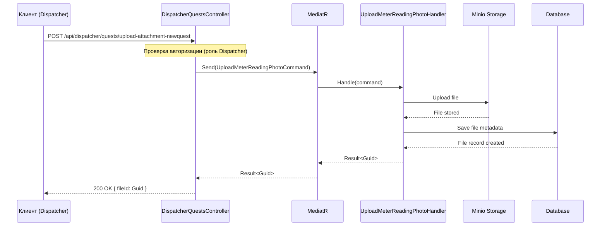

# План: Добавление метода загрузки вложений в DispatcherQuestsController

## Контекст
В системе уже существует метод `POST /upload-task-attachment` в `FileController`, который загружает файлы и возвращает их идентификаторы (Guid). Этот метод используется для прикрепления файлов к заданиям (ServiceQuest) через поле `AttachmentFileIds` в DTO.

Требуется добавить аналогичный метод в `DispatcherQuestsController` с авторизацией для диспетчеров, чтобы они могли загружать вложения непосредственно через API заданий.

## Текущее состояние
- **FileController**: содержит метод `UploadTaskAttachmentAsync`, который использует `UploadMeterReadingPhotoCommand` через MediatR.
- **DispatcherQuestsController**: содержит CRUD-операции для заданий, но не имеет метода загрузки вложений.
- **IDispatcherQuestsService**: не содержит методов для работы с файлами.
- **Зависимости**: проект `MasterApp.WebApi` уже ссылается на модули Files, MediatR зарегистрирован.

## Предлагаемое решение
Добавить в `DispatcherQuestsController` новый метод `UploadAttachmentAsync` со следующими характеристиками:

### Сигнатура метода
```csharp
[HttpPost("upload-attachment-newquest")]
public async Task<IActionResult> UploadAttachmentAsync(IFormFile file, CancellationToken cancellationToken)
```

### Логика работы
1. Принимает файл через `IFormFile`.
2. Создает команду `UploadMeterReadingPhotoCommand` с потоком файла, ContentType и размером.
3. Отправляет команду через `IMediator`.
4. Возвращает `Guid` идентификатора файла в случае успеха.
5. Обрабатывает ошибки аналогично другим методам контроллера (возвращает BadRequest с сообщением).

### Авторизация
Метод будет доступен только пользователям с ролью "Dispatcher" (как и весь контроллер).

### Маршрут
`POST /api/dispatcher/quests/upload-attachment-newquest`

## Необходимые изменения

### 1. Изменения в DispatcherQuestsController.cs
- Добавить using-директивы:
  ```csharp
  using Microsoft.AspNetCore.Http;
  using MediatR;
  using MasterApp.Files.UseCases.Commands.Files.UploadMeterReadingPhoto;
  ```
- Добавить поле `private readonly IMediator _mediator;` в класс контроллера.
- Изменить конструктор для внедрения `IMediator`:
  ```csharp
  public DispatcherQuestsController(IDispatcherQuestsService requestsService, IMediator mediator)
  ```
- Реализовать метод `UploadAttachmentAsync`.

### 2. Пример кода метода
```csharp
[HttpPost("upload-attachment-newquest")]
public async Task<IActionResult> UploadAttachmentAsync(IFormFile file, CancellationToken cancellationToken)
{
    try
    {
        using var stream = file.OpenReadStream();
        var command = new UploadMeterReadingPhotoCommand(stream, file.ContentType, file.Length);
        var result = await _mediator.Send(command, cancellationToken);
        
        if (result.IsFailed)
            return BadRequest(new { message = string.Join(", ", result.Errors.Select(e => e.Message)) });
            
        return Ok(new { fileId = result.Value });
    }
    catch (Exception ex)
    {
        return BadRequest(new { message = ex.Message });
    }
}
```

### 3. Диаграмма последовательности


## Альтернативные варианты
1. **Использовать существующий FileController**: Клиенты могли бы использовать `/upload-task-attachment`, но тогда не будет авторизации по роли Dispatcher (хотя FileController может быть публичным).
2. **Создать отдельную команду для вложений заданий**: Более чистая архитектура, но избыточно, так как логика идентична загрузке фото показаний счетчиков.
3. **Добавить метод в IDispatcherQuestsService**: Усложнит сервис, но обеспечит единую точку логики.

Выбранный вариант (прямое использование MediatR в контроллере) является наиболее простым и соответствует существующему подходу в FileController.

## Проверка
- Метод будет протестирован через Swagger или Postman.
- Убедиться, что загруженные файлы можно прикрепить к заданию через `AttachmentFileIds`.
- Проверить авторизацию: запросы без роли Dispatcher должны возвращать 403.

## Следующие шаги
После утверждения плана можно переключиться в режим Code для реализации.